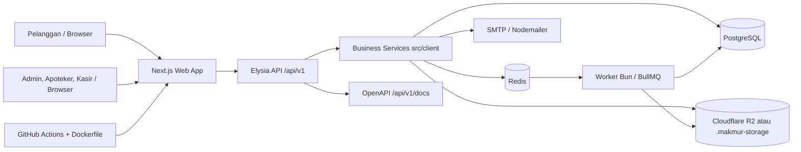

# KEBUTUHAN NONFUNGSIONAL SISTEM

Dokumen ini disusun berdasarkan analisis lokal terhadap proyek Makmur Farma pada 2026-06-06. Informasi teknis diambil dari source code, konfigurasi, skema database, dependency, dan dokumentasi internal proyek. Nilai kapasitas pada dokumen ini adalah asumsi analisis, bukan hasil uji beban produksi.

## 1. Pendahuluan

Dokumentasi kebutuhan nonfungsional ini bertujuan menjelaskan kebutuhan arsitektur, infrastruktur, keamanan, skalabilitas, migrasi, pembaruan, backup, monitoring, panduan pelanggan, FAQ, dan API untuk Makmur Farma. Sistem yang dianalisis adalah aplikasi e-commerce dan manajemen farmasi Klinik Makmur Jaya.

Ruang lingkup implementasi yang ditemukan meliputi katalog obat, kategori obat, supplier, master obat, gambar obat, batch stok, pergerakan stok, keranjang, checkout, pesanan online, transaksi kasir, pembayaran manual dan QRIS simulator, resep, verifikasi resep, pelanggan, pengguna, role dan permission, dashboard, laporan PDF in-memory, import CSV/Excel, notifikasi, audit log, error log, job monitoring, health check, autentikasi, session, dan API.

Modul gudang sebagai entitas terpisah belum ditemukan dalam skema database. Modul pembelian supplier sebagai purchase order terpisah juga belum ditemukan. Karena itu, dokumen ini tidak mengklaim sistem sudah memiliki warehouse management atau procurement formal.

Metode analisis dilakukan dengan membaca `AGENTS.md`, `README.md`, `DESIGN.md`, dokumen pada `docs/`, `package.json`, `.env.example`, `Dockerfile`, `vercel.json`, GitHub workflow, `drizzle.config.ts`, migration SQL, skema Drizzle, route Next.js, route API Elysia, middleware, service pada `src/client/`, utilitas infrastruktur pada `src/lib/`, worker, schema Zod, dan test yang tersedia.

Batasan dokumentasi:

a. Tidak ada secret, password, token, API key, atau nilai `.env` aktual yang ditampilkan.  
b. Data kapasitas adalah simulasi dengan asumsi eksplisit.  
c. Fitur yang tidak ditemukan ditulis sebagai belum dapat diverifikasi.  
d. Dokumen ini tidak menggantikan hasil penetration test, load test, atau audit produksi.

Struktur direktori penting yang ditemukan:

```text
.
|-- docs/
|-- drizzle/
|-- public/
|-- src/
|   |-- api/
|   |-- app/
|   |-- client/
|   |-- components/
|   |-- constants/
|   |-- drizzle-schema/
|   |-- hooks/
|   |-- lib/
|   |-- test/
|   |-- utils/
|   `-- zod-schemas/
|-- Dockerfile
|-- drizzle.config.ts
|-- next.config.ts
|-- package.json
|-- pnpm-lock.yaml
|-- vitest.config.ts
`-- vercel.json
```

## 2. Arsitektur dan Infrastruktur

### 2.1 Gambaran Umum Arsitektur

Makmur Farma menggunakan arsitektur modular monolith berbasis full-stack framework. Bukti implementasinya adalah Next.js App Router pada `src/app/`, API Elysia yang dimount melalui route catch-all Next.js pada `src/app/api/[[...slug]]/route.ts`, business service pada `src/client/`, skema database pada `src/drizzle-schema/index.ts`, dan worker terpisah pada `src/worker.ts`.

Frontend dan backend berada dalam satu repository dan satu build Next.js standalone. API menggunakan pola client-server melalui endpoint HTTP `/api/v1/*`. Controller Elysia relatif tipis dan memanggil service domain seperti `client.auth`, `client.medicines`, `client.orders`, `client.cart`, `client.reports`, `client.imports`, `client.jobs`, dan `client.notifications`.

PostgreSQL menjadi sumber data utama. Redis digunakan untuk queue BullMQ, heartbeat worker, dan rate limiter ketika `REDIS_URL` tersedia. Object storage menggunakan Cloudflare R2 apabila env terkait lengkap, dengan fallback lokal `.makmur-storage` untuk demo atau assessment lokal.

### 2.2 Komponen Arsitektur

| Komponen | Teknologi Aktual | Fungsi | Lokasi Implementasi |
|---|---|---|---|
| Client/frontend | Next.js 16, React 19, TanStack Query, Tailwind CSS | Halaman pelanggan dan operasional | `src/app/`, `src/components/`, `src/hooks/` |
| Backend/API | Elysia, Next.js catch-all route | API internal aplikasi dan dokumentasi API | `src/api/`, `src/app/api/[[...slug]]/route.ts` |
| Business service | TypeScript service class | Aturan domain autentikasi, obat, stok, order, resep, report, import | `src/client/` |
| Database | PostgreSQL dengan Drizzle ORM | Data transaksi, user, session, stok, audit, job | `src/drizzle-schema/index.ts`, `src/lib/db.ts` |
| Queue/worker | BullMQ dan Redis | Report, import, maintenance pembayaran/reservasi | `src/lib/queue.ts`, `src/worker.ts` |
| Object storage | Cloudflare R2 S3-compatible, fallback lokal | File resep dan objek privat; laporan PDF dibuat di memori saat download | `src/lib/object-storage.ts`, `.makmur-storage/` |
| Payment | QRIS simulator dan manual payment state | Simulasi pembayaran demo, override admin | `src/client/qris-simulator.ts`, `src/client/orders.ts` |
| Authentication | Cookie session server-side, Argon2id, CSRF | Login, session, email verification, authorization | `src/client/auth.ts`, `src/lib/session.ts`, `src/lib/csrf.ts` |
| Email service | Nodemailer SMTP | Email verifikasi akun | `src/lib/email.ts` |
| API documentation | `@elysia/openapi` Scalar provider | Dokumentasi API demo | `src/api/index.ts`, `/api/v1/docs` |
| Deployment runtime | Docker standalone Next.js | Build dan run aplikasi produksi | `Dockerfile`, `next.config.ts` |
| CI/build | GitHub Actions reusable workflow | Build dan push container pada `main`/release | `.github/workflows/build.yaml` |
| Monitoring/logging | Health API, job/error tables, console log | Health check, job list, error log, audit log | `src/api/__internal__/index.ts`, `src/client/jobs.ts` |

Reverse proxy dan TLS termination belum dapat diverifikasi dari implementasi proyek saat ini karena tidak ditemukan konfigurasi Nginx, Caddy, Traefik, atau load balancer.

### 2.3 Diagram Topologi Sistem



Pengguna membuka halaman melalui browser. Halaman Next.js menggunakan Eden client, TanStack Query, atau pada satu kasus upload resep menggunakan `fetch()` multipart ke API. API Elysia memvalidasi input, session, CSRF, dan permission, kemudian memanggil service bisnis. Service membaca atau menulis PostgreSQL melalui Drizzle. Proses panjang seperti import dimasukkan ke BullMQ dan diproses worker. Report PDF menyimpan metadata di database, lalu PDF dibuat ulang di memori saat download. File privat disimpan di R2 bila dikonfigurasi atau fallback lokal untuk demo.

### 2.4 Alur Permintaan Sistem

Alur permintaan umum:

a. Pengguna membuka halaman Next.js, misalnya katalog, keranjang, dashboard, atau halaman operasional.  
b. Frontend mengirim request ke `/api/v1/*` melalui Eden client atau request HTTP biasa untuk upload multipart.  
c. API memvalidasi body, params, atau query dengan schema Zod di `src/zod-schemas/index.ts`.  
d. Endpoint terlindungi memanggil `requireSession`, `requirePermission`, atau `requireRole`. Mutation memakai pemeriksaan origin dan CSRF.  
e. Service pada `src/client/` menjalankan aturan bisnis, transaksi database, audit log, dan notifikasi.  
f. Drizzle menjalankan query PostgreSQL. Mutasi stok sensitif menggunakan transaksi dan atomic update.  
g. Bila proses lambat, service membuat `job_runs` dan menambahkan pekerjaan ke BullMQ.  
h. API mengembalikan response JSON atau file download.  
i. Frontend memperbarui tampilan melalui TanStack Query, state lokal, loading state, empty state, dan error state.

### 2.5 Spesifikasi Minimum Server

Tabel berikut adalah rekomendasi awal untuk deployment kecil sampai menengah. Dasarnya adalah kebutuhan runtime Node 22, PostgreSQL 16, Redis, Next.js standalone, worker BullMQ, dan beban simulasi pada bagian 2.6. Nilai ini bukan hasil load test.

| Komponen | Minimum Development | Minimum Production | Rekomendasi Production | Dasar Rekomendasi |
|---|---:|---:|---:|---|
| CPU | 2 core | 2 vCPU | 4 vCPU | Development menjalankan Next, DB, Redis, worker. Produksi butuh ruang untuk API, worker, dan query dashboard. |
| RAM | 4 GB | 4 GB | 8 GB | Next.js, PostgreSQL, Redis, dan worker perlu memori terpisah; 8 GB memberi cadangan cache DB dan build artifact. |
| Storage | 20 GB SSD | 50 GB SSD | 150 GB SSD atau object storage terpisah | High scenario memperkirakan DB dan file dapat tumbuh puluhan GB/tahun. |
| Bandwidth | Lokal | 50 GB/bulan | 200 GB/bulan | Berdasarkan simulasi response API, katalog, upload resep, dan akses gambar. |
| Sistem operasi | Windows/Linux dev | Linux 64-bit | Linux LTS 64-bit | Dockerfile memakai image Linux berbasis Node 22. |
| Database | PostgreSQL 16 lokal | PostgreSQL 16 | Managed PostgreSQL atau VM terpisah | README menyebut PostgreSQL 16+. |
| Runtime | Node 22, pnpm 10 | Node 22 standalone | Node 22 container + process manager | `package.json` dan `Dockerfile` memakai Node 22. |
| Redis | Opsional dev | Redis 7 setara | Redis terkelola atau instance terpisah | Queue dan rate limit lintas instance membutuhkan Redis stabil. |

Lingkungan development dapat menjalankan semua komponen pada satu mesin karena beban rendah dan data kecil. Lingkungan production sebaiknya memisahkan database dan object storage dari server aplikasi agar backup, pemantauan, dan skalabilitas lebih terkendali.

### 2.6 Analisis Kapasitas Server

Asumsi skenario:

| Skenario | Pengguna Bersamaan | Transaksi per Hari | Karakteristik |
|---|---:|---:|---|
| Beban rendah | 10 asumsi | 50 asumsi | Tahap awal klinik, katalog dan transaksi terbatas |
| Beban menengah | 30 asumsi | 250 asumsi | Operasional normal klinik dengan customer online |
| Beban tinggi | 100 asumsi | 1.000 asumsi | Jam sibuk, promosi, atau batch order tinggi |

Asumsi perhitungan:

a. Satu transaksi menghasilkan rata-rata 12 request API langsung untuk katalog, cart, checkout, status, pembayaran, dan notifikasi.  
b. Aktivitas non-transaksi seperti pencarian katalog, dashboard, dan riwayat diasumsikan 5 kali volume transaksi. Total request harian = transaksi per hari x 60.  
c. Faktor puncak = 10 kali RPS rata-rata.  
d. Ukuran rata-rata response dinamis = 75 KB.  
e. Ukuran rata-rata satu transaksi database = 20 KB sebelum indeks dan audit tambahan. Faktor indeks/audit = 2 kali. Cadangan growth = 30 persen.  
f. Rata-rata dokumen resep = 1,5 MB. Proporsi transaksi resep = 20 persen. Gambar produk diasumsikan dikelola di object storage.

Perhitungan request:

```text
RPS rata-rata = jumlah request harian / 86.400 detik
RPS puncak = RPS rata-rata x faktor beban puncak
```

| Skenario | Request Harian Asumsi | RPS Rata-rata | RPS Puncak Asumsi |
|---|---:|---:|---:|
| Beban rendah | 3.000 | 0,035 | 0,35 |
| Beban menengah | 15.000 | 0,174 | 1,74 |
| Beban tinggi | 60.000 | 0,694 | 6,94 |

Perhitungan storage database tahunan:

```text
Storage transaksi tahunan =
transaksi per hari x 20 KB x 365 x faktor indeks/audit 2 x cadangan 1,3
```

| Skenario | Estimasi DB Tahunan |
|---|---:|
| Beban rendah | sekitar 0,95 GB |
| Beban menengah | sekitar 4,75 GB |
| Beban tinggi | sekitar 18,98 GB |

Perhitungan file resep tahunan:

```text
Storage resep tahunan =
transaksi per hari x 20 persen x 1,5 MB x 365
```

| Skenario | Estimasi File Resep Tahunan |
|---|---:|
| Beban rendah | sekitar 5,5 GB |
| Beban menengah | sekitar 27,4 GB |
| Beban tinggi | sekitar 109,5 GB |

Perhitungan bandwidth bulanan:

```text
Bandwidth dinamis bulanan =
request harian x 75 KB x 30
```

| Skenario | Bandwidth Dinamis Bulanan | Catatan |
|---|---:|---|
| Beban rendah | sekitar 6,8 GB | Belum termasuk gambar produk |
| Beban menengah | sekitar 33,8 GB | Object storage/CDN mulai bermanfaat |
| Beban tinggi | sekitar 135 GB | Upload resep sekitar 9 GB/bulan dengan asumsi 20 persen transaksi resep |

Batasan perhitungan: ukuran response, ukuran transaksi, proporsi resep, dan faktor puncak belum divalidasi melalui observability produksi. Angka harus diperbarui setelah tersedia access log, metrik request, ukuran database aktual, dan statistik object storage.

### 2.7 Rekomendasi Infrastruktur

Untuk MVP BNSP dan klinik kecil, satu server aplikasi yang menjalankan Next.js standalone dan worker masih proporsional bila PostgreSQL dan Redis dikelola terpisah. Alternatif satu mesin untuk semua komponen dapat digunakan untuk demo lokal, tetapi kurang baik untuk produksi karena backup, pemeliharaan, dan resource contention lebih sulit dikendalikan.

Rekomendasi proporsional:

a. Gunakan satu container aplikasi Next.js dan satu process worker terpisah.  
b. Gunakan PostgreSQL terpisah atau managed database untuk menjaga data transaksi.  
c. Gunakan Redis stabil untuk BullMQ dan rate limiting lintas instance.  
d. Gunakan Cloudflare R2 atau object storage S3-compatible untuk resep dan objek privat yang perlu disimpan, bukan storage lokal server produksi. Laporan PDF dibuat ulang di memori saat download sehingga tidak memerlukan file permanen.  
e. Pasang reverse proxy dengan HTTPS/TLS walaupun konfigurasi belum ada di repository.  
f. Gunakan backup database terjadwal dan backup object storage.  
g. CDN dapat dipertimbangkan untuk gambar produk publik bila trafik katalog naik.  
h. Load balancer dan horizontal scaling belum perlu untuk MVP, tetapi aplikasi perlu Redis dan session database agar lebih siap multi-instance.  
i. Kubernetes belum proporsional untuk cakupan saat ini.

### 2.8 Keamanan Infrastruktur

Kondisi aktual:

a. Header keamanan tersedia pada `next.config.ts`: CSP, Permissions-Policy, Referrer-Policy, X-Content-Type-Options, dan frame-ancestors.  
b. Session menggunakan cookie HTTP-only, SameSite=Lax, dan secure flag aktif pada production.  
c. CSRF diterapkan melalui validasi Origin/Referer dan header `x-csrf-token`.  
d. Rate limiting tersedia untuk login, registrasi, verifikasi email, dan resend verification.  
e. Password memakai Argon2id.  
f. Audit log tersedia pada tabel `audit_logs`.  
g. Object storage privat tersedia melalui R2 atau fallback lokal.  
h. Secrets dibaca dari environment variable.

Rekomendasi tambahan:

a. Wajibkan HTTPS/TLS di reverse proxy atau platform hosting.  
b. Batasi akses database hanya dari aplikasi dan admin teknis.  
c. Enkripsi backup database dan object storage.  
d. Jangan gunakan fallback `.makmur-storage` sebagai storage produksi utama.  
e. Pastikan `ENABLE_PAYMENT_SIMULATOR=false` di production.  
f. Tambahkan scanning dependency rutin dan alert keamanan.  
g. Tambahkan rate limit untuk endpoint upload dan endpoint mutation penting selain autentikasi.  
h. Tambahkan monitoring CPU, RAM, disk, response time, dan error rate.

## 3. Tools dan Framework

### 3.1 Inventarisasi Teknologi

Versi berikut diverifikasi dari `package.json` dan package metadata lokal pada `node_modules`.

| Kategori | Tools/Framework | Versi | Fungsi | Lokasi Penggunaan | Alasan Pemilihan |
|---|---:|---:|---|---|---|
| Runtime | Node.js | 22.21.1 pada Dockerfile, >=22.0.0 pada package | Runtime aplikasi Next.js | `Dockerfile`, `package.json` | Kompatibel dengan Next.js 16 dan build standalone |
| Package manager | pnpm | 10.30.3 | Instalasi dependency | `package.json`, `pnpm-lock.yaml` | Cepat dan lockfile deterministik |
| Frontend | Next.js | 16.2.6 resolved | App Router, build standalone | `src/app/`, `next.config.ts` | Full-stack framework, routing dan deployment terintegrasi |
| UI runtime | React / React DOM | 19.2.6 | Komponen UI | `src/app/`, `src/components/` | Basis Next.js modern |
| Backend | Elysia | 1.4.28 | HTTP API | `src/api/` | Controller ringkas dan typed API |
| API client | `@elysiajs/eden` | 1.4.9 | Client typed API | `src/lib/eden.ts`, pages | Mengurangi raw fetch untuk API internal |
| Database | PostgreSQL | 16+ berdasarkan README | Penyimpanan data utama | `src/lib/db.ts`, `drizzle.config.ts` | Relasional dan cocok untuk transaksi farmasi |
| ORM | Drizzle ORM | 0.36.4 | Query dan schema database | `src/drizzle-schema/`, `src/client/` | Type-safe SQL dan migration |
| Styling | Tailwind CSS | 4.3.0 | Styling UI | `src/app/globals.css`, components | Konsisten dengan design system |
| State server | TanStack Query | 5.100.10 | Fetch/cache server state | Halaman client | Loading/error/cache lebih terstruktur |
| Form | TanStack React Form | 1.32.0 | Form state | Dependency proyek | Mendukung form type-safe |
| Table | TanStack Table | 8.21.3 | Data table | Komponen/table pages | Cocok untuk list operasional |
| Validation | Zod | 4.4.3 | Validasi input | `src/zod-schemas/index.ts` | Shared schema dan pesan validasi |
| Password | `@node-rs/argon2` | 2.0.2 | Hash password Argon2id | `src/lib/password.ts` | Password hashing aman |
| Token/JWT library | jose | 6.2.3 | Crypto/JWT support dependency | Dependency proyek | Library JOSE standar, penggunaan spesifik belum dominan |
| Queue | BullMQ | 5.77.3 | Background job | `src/lib/queue.ts`, `src/worker.ts` | Retry, backoff, queue Redis |
| Redis client | ioredis | 5.10.1 | Redis connection | Queue, rate limiter, monitoring | Stabil untuk BullMQ dan Redis |
| Object storage | aws4fetch | 1.0.20 | S3-compatible R2 request signing | `src/lib/object-storage.ts` | Integrasi R2 tanpa SDK besar |
| Email | Nodemailer | 8.0.8 | SMTP verification email | `src/lib/email.ts` | Adapter SMTP umum |
| Payment | QRIS simulator internal | Tidak ada provider eksternal | Demo pembayaran | `src/client/qris-simulator.ts` | Simulasi assessment, bukan gateway produksi |
| PDF | pdfmake | 0.2.23 | Dependency PDF report | `package.json`; report memakai generator PDF in-memory sederhana | Mendukung laporan PDF, meski implementasi report saat ini membuat PDF langsung di memori |
| Import | csv-parse, exceljs | 5.6.0, 4.4.0 | Parsing CSV dan Excel | `src/worker.ts` | Mendukung import data obat |
| Upload validation | file-type, mime-types | 20.5.0, 2.1.35 | Deteksi/metadata file | Dependency proyek, upload constants | Validasi file |
| Chart | Recharts | 3.8.1 | Grafik dashboard | Dashboard/components | Visualisasi metrik |
| Containerization | Docker | Dockerfile | Build standalone app | `Dockerfile` | Deployment reproducible |
| Testing | Vitest | 3.2.4 | Unit test | `src/**/*.test.ts` | Test TypeScript cepat |
| API documentation | `@elysia/openapi` | 1.4.15 | OpenAPI UI/JSON | `src/api/index.ts` | Dokumentasi API demo |
| Lint/format | ESLint, Prettier | 9.x, 3.x | Kualitas kode | config root | Pemeriksaan statis |

### 3.2 Analisis Alasan Pemilihan

Next.js dipilih karena aplikasi membutuhkan UI pelanggan, UI dashboard operasional, route server, dan build production dalam satu repository. Elysia dipakai untuk API modular yang tetap berada di dalam aplikasi Next.js melalui catch-all route. Drizzle dan PostgreSQL cocok karena domain farmasi membutuhkan transaksi, foreign key, indeks, audit log, dan data stok batch yang konsisten.

TanStack Query membantu halaman client menangani server state, loading, error, dan invalidation. Zod digunakan agar validasi request tidak hanya bergantung pada frontend. BullMQ dan Redis dipakai karena import, payment follow-up, dan maintenance tidak ideal dijalankan sinkron dalam request pengguna. R2/S3-compatible storage dipilih agar file resep dan objek privat tidak bergantung pada filesystem server aplikasi; laporan PDF dibuat ulang di memori saat download.

### 3.3 Analisis Skalabilitas

Fitur skalabilitas yang sudah tersedia:

a. Pagination server-side tersedia melalui `getFilters()` dengan `MAX_LIMIT=100`. Banyak list service mengembalikan `data` dan `pagination`.  
b. Filtering dan sorting tersedia pada obat, kategori, supplier, batch, stock movements, order, payment, prescription, job, error, import, dan report.  
c. Search memakai `ilike` dengan escape karakter `%` dan `_`.  
d. Indeks database tersedia pada email, normalized email, role, status, createdAt, foreign key, order number, payment reference, batch expiry, dan kolom lookup penting.  
e. Koneksi database dipisahkan antara `db` write dan `readDb` read dengan pool `max: 10`.  
f. Stock reservation dan counter sale memakai transaksi database dan atomic update quantity.  
g. Background processing tersedia untuk import; report PDF saat ini diselesaikan inline dan PDF dirender ulang di memori saat download agar tidak tergantung file permanen.  
h. Object storage tersedia untuk file privat.  
i. Session disimpan di PostgreSQL sehingga lebih siap multi-instance dibanding memory session.  
j. Rate limiter memakai Redis bila tersedia dan fallback memory untuk development.  
k. Beberapa UI search memakai debounce, misalnya katalog menggunakan `useDebounce(search.trim(), 300)`.

Fitur skalabilitas yang belum tersedia atau perlu ditingkatkan:

a. Search masih `ilike`; full-text search atau trigram index belum ditemukan.  
b. Tidak ditemukan cache domain untuk katalog populer.  
c. Tidak ditemukan CDN untuk gambar produk.  
d. Tidak ditemukan WebSocket/SSE; stock sync memakai polling watermark.  
e. Tidak ditemukan auto-scaling atau load balancer configuration.  
f. OpenAPI sudah mounted, tetapi route-level request/response schema belum lengkap untuk semua endpoint.  
g. Integration test dan concurrency test PostgreSQL belum lengkap.  
h. Monitoring CPU, RAM, disk, dan access log belum terhubung ke data source nyata.

### 3.4 Analisis Potensi Bottleneck

| Potensi Bottleneck | Penyebab | Dampak | Tingkat Risiko | Rekomendasi |
|---|---|---|---|---|
| Search katalog dan operasional berbasis `ilike` | Query teks wildcard pada banyak baris | Lambat saat data obat/order besar | Sedang | Tambahkan index sesuai pola search, pertimbangkan PostgreSQL full-text/trigram |
| Upload melalui server aplikasi | File resep multipart dibaca ke buffer sebelum disimpan | Memori server naik pada upload bersamaan | Sedang | Batasi ukuran, rate limit upload, gunakan presigned upload untuk produksi |
| Fallback object storage lokal | `.makmur-storage` berada di filesystem aplikasi | File hilang saat container diganti bila volume tidak dipasang | Tinggi produksi | Wajibkan R2/S3-compatible storage produksi |
| Redis opsional | Rate limiter fallback memory dan queue butuh Redis | Multi-instance tidak konsisten tanpa Redis | Sedang | Wajibkan Redis untuk production |
| Report PDF dibatasi query 200 row | Generator in-memory membuat PDF sederhana dari transaksi paid | Laporan besar tidak lengkap bila data banyak | Sedang | Tambahkan pagination internal/report streaming dan parameter limit yang jelas |
| QRIS simulator bukan gateway nyata | Tidak ada provider production callback | Pembayaran nyata belum dapat diproses otomatis | Tinggi bila go-live | Implementasikan provider adapter dan signature verification |
| CI hanya build container | Workflow tidak menunjukkan lint/test/typecheck | Regression dapat lolos ke image | Sedang | Tambahkan job `pnpm tsc`, `pnpm lint`, `pnpm test`, dan build |
| Monitoring infrastruktur terbatas | CPU/RAM/disk belum menjadi sumber data dashboard | Gangguan resource tidak cepat terlihat | Sedang | Integrasikan metrics exporter atau platform monitoring |

### 3.5 Dokumentasi Library dan Komponen Pihak Ketiga

| Library/Komponen | Versi | Lisensi | Fungsi | Status Penggunaan | Risiko/Pertimbangan |
|---|---:|---|---|---|---|
| Next.js | 16.2.6 | MIT | Framework web | Aktif | Breaking change framework harus diuji sebelum upgrade |
| React | 19.2.6 | MIT | UI runtime | Aktif | Perubahan concurrent rendering perlu test UI |
| Elysia | 1.4.28 | MIT | API framework | Aktif | Dokumentasi route schema perlu dilengkapi |
| Drizzle ORM | 0.36.4 | Apache-2.0 | ORM/query | Aktif | Migration harus dikontrol, jangan schema push |
| postgres | 3.4.9 | Unlicense | PostgreSQL driver | Aktif | Pooling dan timeout perlu dipantau |
| Zod | 4.4.3 | MIT | Validasi | Aktif | Schema harus sinkron dengan UI dan API |
| BullMQ | 5.77.3 | MIT | Queue | Aktif | Membutuhkan Redis stabil |
| ioredis | 5.10.1 | MIT | Redis client | Aktif | Kegagalan Redis berdampak ke queue/rate limit |
| `@node-rs/argon2` | 2.0.2 | MIT | Password hashing | Aktif | Parameter hash perlu dievaluasi sesuai kapasitas server |
| Nodemailer | 8.0.8 | MIT-0 | SMTP email | Aktif | Delivery bergantung provider SMTP |
| aws4fetch | 1.0.20 | MIT | R2/S3 signing | Aktif | Env R2 wajib aman |
| TanStack Query | 5.100.10 | MIT | Server state | Aktif | Cache invalidation harus dirawat |
| TanStack Table | 8.21.3 | MIT | Table UI | Dependency | Risiko rendah |
| TanStack React Form | 1.32.0 | MIT | Form | Dependency | Pastikan konsisten dengan Zod |
| Recharts | 3.8.1 | MIT | Chart dashboard | Aktif | Chart besar dapat berat di browser |
| pdfmake | 0.2.23 | MIT | PDF | Dependency | Report saat ini memakai generator in-memory sederhana; manfaat pdfmake perlu ditinjau |
| exceljs | 4.4.0 | MIT | Excel import | Aktif | File besar dapat berat di memory |
| csv-parse | 5.6.0 | MIT | CSV import | Aktif | Validasi row tetap harus kuat |
| rate-limiter-flexible | 11.1.0 | ISC | Rate limiting | Aktif | Redis dianjurkan untuk production |
| Tailwind CSS | 4.3.0 | MIT | Styling | Aktif | Upgrade bisa memengaruhi token/style |
| Vitest | 3.2.4 | MIT | Test | Aktif | Cakupan integration masih kurang |

## 4. Kebutuhan Migrasi dan Pembaruan

### 4.1 Gambaran Skenario Migrasi

Skenario migrasi yang proporsional adalah perpindahan dari spreadsheet apotek atau catatan manual menuju database Makmur Farma. Data yang relevan dengan skema aktual meliputi obat, kategori, supplier, stok awal per batch, pelanggan, pengguna, role, resep, transaksi lama bila diperlukan, pembayaran, dan audit awal. Data gudang tidak dimasukkan karena tabel warehouse belum ditemukan.

Migrasi harus disesuaikan dengan tabel aktual: `medicines`, `medicine_categories`, `suppliers`, `medicine_batches`, `stock_movements`, `users`, `customer_profiles`, `orders`, `order_items`, `payments`, `prescriptions`, dan `prescription_reviews`.

### 4.2 Strategi Migrasi Data Obat

Tahapan migrasi:

a. Inventarisasi file sumber, pemilik data, periode data, dan format kolom.  
b. Pembersihan data duplikat, nama obat kosong, harga tidak valid, batch kosong, dan tanggal tidak valid.  
c. Standarisasi kode obat, kode kategori, satuan, format harga, dan format tanggal `YYYY-MM-DD`.  
d. Mapping field lama ke field sistem baru berdasarkan skema Drizzle.  
e. Transformasi ke format CSV/XLSX yang dapat dibaca worker.  
f. Validasi row sebelum import produksi.  
g. Import staging dan pemeriksaan hasil `import_runs` serta `import_row_results`.  
h. Import production setelah freeze transaksi manual.  
i. Rekonsiliasi jumlah obat, stok, batch, dan nilai persediaan.  
j. Persetujuan hasil migrasi oleh perwakilan apotek dan administrator sistem.

### 4.3 Mapping Field

| Kolom Data Lama | Field Sistem Baru | Tipe Data | Transformasi | Validasi | Keterangan |
|---|---|---|---|---|---|
| Kode obat | `medicines.code` | text | Uppercase, trim, normalisasi karakter | Wajib, unik | Worker memakai `normalizeCode("MED", value)` bila kosong |
| Nama obat | `medicines.name` | text | Trim | Wajib | Minimal harus ada untuk import row valid |
| Kategori | `medicine_categories.name` dan `medicines.category_id` | text/uuid | Cari atau buat kategori | Boleh kosong, jika ada harus valid | Worker `ensureCategory()` dapat membuat kategori |
| Satuan | `medicines.unit` | text | Default `unit` bila kosong | Maksimal sesuai schema Zod | Contoh: tablet, botol, strip |
| Harga beli | `medicine_batches.purchase_cost` | numeric(14,2) | Hapus simbol mata uang, 2 desimal | Non-negatif | Dibutuhkan bila membuat batch |
| Harga jual | `medicines.selling_price` | numeric(14,2) | Hapus simbol mata uang, 2 desimal | Wajib, non-negatif | `sellingPrice` wajib valid |
| Stok | `medicine_batches.available_quantity` dan `stock_movements.quantity_delta` | integer | Bilangan bulat positif | Tidak boleh negatif | Stok awal dicatat sebagai `IMPORT_OPENING` |
| Tanggal terima | `medicine_batches.received_date` | date | Format tanggal | Wajib untuk batch | Harus sebelum tanggal kedaluwarsa |
| Tanggal kedaluwarsa | `medicine_batches.expiry_date` | date | Format tanggal | Wajib untuk batch | Batch expired tidak boleh dialokasikan |
| Nomor batch | `medicine_batches.batch_number` | text | Trim | Wajib untuk batch | Unik per obat |
| Supplier | `suppliers.name` dan `medicine_batches.supplier_id` | text/uuid | Cari atau buat supplier | Boleh kosong | Worker `ensureSupplier()` dapat membuat supplier |
| Perlu resep | `medicines.prescription_required` | boolean | `true/ya/y/1/perlu/resep/yes` menjadi true | Boolean | Tidak berisi klaim medis |
| Batas stok rendah | `medicines.low_stock_threshold` | integer | Default 10 bila kosong | Non-negatif | Untuk alert |
| Batas stok kritis | `medicines.critical_stock_threshold` | integer | Default 3 bila kosong | Non-negatif dan <= low stock | Untuk alert |

### 4.4 Aturan Validasi Data Migrasi

Validasi migrasi yang diperlukan:

a. Field wajib: nama obat, harga jual, dan kode obat atau data yang dapat dibuat menjadi kode.  
b. Duplikasi kode obat pada `medicines.code`.  
c. Harga beli dan jual harus angka non-negatif dengan maksimal dua desimal.  
d. Stok awal harus bilangan bulat positif bila batch dibuat.  
e. Tanggal harus dapat diparse dan sebaiknya distandarkan menjadi `YYYY-MM-DD`.  
f. Tanggal kedaluwarsa harus lebih besar dari tanggal terima.  
g. Kategori dan supplier boleh dibuat otomatis, tetapi harus direkonsiliasi agar tidak terjadi duplikasi nama.  
h. Nomor batch wajib jika stok awal dimasukkan.  
i. Relasi foreign key harus valid setelah import.  
j. Data pengguna harus memiliki role yang sesuai enum `ADMIN`, `PHARMACIST`, `CASHIER`, atau `CUSTOMER`.

### 4.5 Penanganan Data Tidak Valid

Mekanisme yang direkomendasikan:

a. Data valid diimpor ke staging atau production sesuai jadwal.  
b. Data tidak valid dicatat pada `import_row_results` dengan status `FAILED`.  
c. Kesalahan diperbaiki pada file sumber atau staging.  
d. Data diimpor ulang setelah mapping diperbaiki.  
e. Hasil akhir diverifikasi melalui daftar import, row result, stock movement, dan batch.

Contoh laporan kesalahan:

| Nomor Baris | Identifier | Field Bermasalah | Nilai Lama | Penyebab | Tindakan |
|---:|---|---|---|---|---|
| 12 | MED-001 | `sellingPrice` | `abc` | Harga jual bukan angka | Perbaiki menjadi angka non-negatif |
| 18 | Paracetamol | `expiryDate` | `2025/13/01` | Tanggal tidak valid | Gunakan format `YYYY-MM-DD` |
| 25 | BAT-778 | `openingQuantity` | `-5` | Stok negatif | Koreksi stok awal |

### 4.6 Validasi Pascamigrasi

Pemeriksaan pascamigrasi:

a. Bandingkan jumlah record obat, kategori, supplier, dan batch.  
b. Bandingkan total stok per obat dan total stok keseluruhan.  
c. Bandingkan nilai persediaan berdasarkan harga beli batch.  
d. Periksa relasi obat-kategori, batch-obat, batch-supplier, dan stock movement.  
e. Periksa data kosong pada field wajib.  
f. Periksa duplikasi kode, slug, nomor batch per obat, dan email pengguna.  
g. Sampling data minimal beberapa obat dari setiap kategori.  
h. Uji transaksi online dan kasir.  
i. Uji pencarian katalog dan dashboard stok.  
j. Minta persetujuan administrator dan perwakilan apotek.

### 4.7 Rollback Plan Migrasi

Rencana rollback:

a. Ambil backup database sebelum migrasi.  
b. Ambil backup object storage bila migrasi menyertakan file resep atau gambar.  
c. Tandai versi data atau waktu cutover.  
d. Hentikan sementara transaksi manual dan online saat import production.  
e. Jika rollback dipicu, restore database dari backup terakhir.  
f. Restore object storage dari backup atau hapus objek yang dibuat setelah marker migrasi.  
g. Verifikasi login, katalog, stok, order, dan laporan setelah restore.  
h. Komunikasikan status rollback kepada admin, apoteker, kasir, dan pelanggan yang terdampak.  
i. Dokumentasikan insiden dan tindakan perbaikan.

Pemicu rollback:

a. Selisih total stok melebihi toleransi yang disepakati.  
b. Relasi data rusak atau foreign key gagal.  
c. Transaksi utama tidak dapat dilakukan.  
d. File resep atau gambar penting hilang.  
e. Sistem mengalami kegagalan kritis setelah migrasi.  
f. Data pembayaran/order tidak konsisten.

## 5. Dokumen Cutover Plan

### 5.1 Tujuan Cutover

Cutover bertujuan memindahkan operasional dari sistem lama atau spreadsheet ke Makmur Farma dengan gangguan minimal, menjaga integritas stok, memastikan pengguna dapat login sesuai role, dan memastikan transaksi farmasi tercatat melalui database serta audit log.

### 5.2 Timeline Cutover

| Waktu | Kegiatan | Penanggung Jawab | Output | Kriteria Berhasil |
|---|---|---|---|---|
| H-14 | Persiapan data dan mapping | Project manager, perwakilan apotek, developer | File sumber bersih | Field utama lengkap |
| H-7 | Simulasi migrasi staging | Developer, database administrator | Import staging dan row errors | Selisih data dapat dijelaskan |
| H-3 | UAT akhir | Perwakilan apotek, admin, apoteker, kasir | Catatan UAT | Fungsi kritis lulus |
| H-1 | Backup dan data freeze | Database administrator, admin sistem | Backup DB/storage | Backup dapat diverifikasi |
| H | Migrasi produksi | Developer, database administrator | Data production termigrasi | Rekonsiliasi awal lulus |
| H+1 | Verifikasi operasional | Admin, apoteker, kasir | Checklist pascacutover | Transaksi berjalan |
| H+7 | Evaluasi | Project manager, tim teknis | Laporan evaluasi | Risiko lanjutan diprioritaskan |

### 5.3 Checklist Pra-Cutover

- [ ] UAT disetujui.
- [ ] Backup database tersedia dan diuji restore.
- [ ] Backup object storage tersedia bila ada file.
- [ ] Data obat, kategori, supplier, batch, dan stok sudah divalidasi.
- [ ] Server aplikasi siap.
- [ ] PostgreSQL siap.
- [ ] Redis siap.
- [ ] Object storage siap.
- [ ] SMTP siap bila email verifikasi digunakan.
- [ ] Payment simulator dimatikan untuk production, kecuali demo assessment.
- [ ] Akun admin aktif.
- [ ] Domain dan TLS siap.
- [ ] Monitoring dasar dan health check siap.
- [ ] Rollback plan disetujui.
- [ ] Pengguna diberi pemberitahuan jadwal cutover.

### 5.4 Langkah Pelaksanaan Cutover

a. Umumkan freeze data dan hentikan perubahan stok pada sistem lama.  
b. Ambil backup database dan object storage.  
c. Deploy aplikasi versi final ke environment production.  
d. Pastikan environment variable terisi tanpa menampilkan nilainya.  
e. Jalankan migration database sesuai prosedur yang disetujui.  
f. Jalankan import data produksi.  
g. Periksa import summary dan row-level errors.  
h. Rekonsiliasi total stok dan jumlah record.  
i. Aktifkan akses pengguna operasional.  
j. Uji login, katalog, batch, order, pembayaran, resep, report, dan monitoring.  
k. Putuskan Go atau No-Go berdasarkan tabel kriteria.  
l. Dokumentasikan hasil cutover.

### 5.5 Verifikasi Pascacutover

Modul yang perlu diverifikasi berdasarkan implementasi aktual:

a. Login, logout, session, dan role redirect.  
b. Hak akses admin, apoteker, kasir, dan customer.  
c. Katalog dan detail obat.  
d. Keranjang dan checkout.  
e. Upload resep PDF/JPG/PNG maksimal 5 MB.  
f. Verifikasi resep oleh apoteker.  
g. Master obat, kategori, supplier.  
h. Batch stok dan stock adjustment.  
i. Pergerakan stok dan reservasi stok.  
j. Order online dan transaksi kasir.  
k. Pembayaran manual/QRIS simulator sesuai environment.  
l. Riwayat pembelian dan resep pelanggan.  
m. Import CSV/XLSX.  
n. Laporan PDF.  
o. Notifikasi, audit log, error log, jobs, dan monitoring.  
p. API docs bila `ENABLE_API_DOCS=true`.

### 5.6 Kriteria Go atau No-Go

| Kriteria | Go | No-Go |
|---|---|---|
| Integritas data | Jumlah obat, batch, dan stok sesuai toleransi | Selisih stok tidak dapat dijelaskan |
| Fungsi kritis | Login, katalog, stok, order, resep, kasir berjalan | Salah satu fungsi kritis gagal |
| Keamanan | Env aman, HTTPS siap, session/CSRF berjalan | Secret bocor atau HTTPS tidak siap |
| Performa | Response dasar stabil pada smoke test | Halaman/API sering timeout |
| Pembayaran | Metode yang diaktifkan sesuai konfigurasi | Simulator aktif tidak sengaja pada production |
| Stok | Stock movement tercatat dan stok tidak negatif | Mutasi stok tidak tercatat |
| Backup | Backup tersedia dan dapat diverifikasi | Backup tidak ada atau gagal restore |

## 6. Skenario Pembaruan Perangkat Lunak

### 6.1 Strategi Version Control

Proyek menggunakan Git. Bukti workflow terdapat pada `.github/workflows/build.yaml`, yang menjalankan reusable workflow build dan push container pada push ke `main` serta release created. Tidak ditemukan aturan branch protection, pull request, commit convention, atau tag release di source lokal.

Rekomendasi workflow:

a. Gunakan branch `main` untuk source stabil.  
b. Buat branch fitur dengan pola `feature/nama-fitur` atau `fix/nama-bug`.  
c. Gunakan commit message ringkas seperti `feat: menambahkan filter riwayat transaksi`.  
d. Wajibkan pull request dan code review untuk perubahan production.  
e. Jalankan `pnpm tsc`, `pnpm lint`, `pnpm test`, dan `pnpm build` sebelum merge.  
f. Gunakan tag versi untuk release.  
g. Buat release note berisi perubahan, migration, risiko, dan rollback.  
h. Gunakan branch hotfix untuk bug kritis.

### 6.2 Simulasi Penambahan Fitur

Fitur simulasi: penambahan filter status dan tanggal pada riwayat pesanan pelanggan di halaman akun. Fitur ini relevan karena endpoint `GET /api/v1/account/orders` sudah memakai list order dengan query dan pagination, tetapi halaman akun saat ini mengambil 10 order terbaru.

Siklus pembaruan:

a. Buat issue berisi kebutuhan filter status dan rentang tanggal.  
b. Analisis dampak pada query account order, UI akun, permission customer, dan test.  
c. Buat branch `feature/filter-riwayat-pesanan`.  
d. Implementasi UI filter dan query parameter.  
e. Tambah unit test util filter bila ada logic baru.  
f. Tambah integration/API test untuk customer isolation bila tersedia.  
g. Jalankan typecheck, lint, test, build.  
h. Code review.  
i. Merge ke main.  
j. Deploy staging.  
k. UAT oleh perwakilan pengguna.  
l. Deploy production.  
m. Monitor error log, response time, dan keluhan pengguna.  
n. Rollback bila filter menyebabkan data pelanggan lain terlihat atau halaman akun gagal.

### 6.3 Contoh Alur Git

```bash
git checkout main
git pull origin main
git checkout -b feature/filter-riwayat-pesanan
git add .
git commit -m "feat: menambahkan filter riwayat pesanan"
git push origin feature/filter-riwayat-pesanan
```

Contoh tersebut harus disesuaikan dengan kebijakan repository dan tidak menggantikan proses review.

### 6.4 Strategi Deployment Pembaruan

Strategi paling proporsional untuk kondisi saat ini adalah recreate deployment dengan maintenance window pendek untuk perubahan biasa, atau rolling update sederhana bila platform mendukung beberapa instance. Blue-green deployment dapat dipakai jika aplikasi mulai menangani transaksi nyata dan membutuhkan rollback cepat. Canary belum perlu untuk MVP karena kompleksitasnya lebih tinggi daripada manfaat saat beban masih kecil.

Untuk perubahan database, deployment harus mengutamakan backward compatibility: schema baru diterapkan lebih dulu, aplikasi baru dideploy setelah migration siap, dan rollback aplikasi tidak boleh merusak data baru.

### 6.5 Rollback Pembaruan

Rollback source code dilakukan dengan deploy ulang image atau commit versi sebelumnya. Rollback Docker image dilakukan dengan menarik tag image stabil terakhir. Rollback database migration harus menggunakan migration `down` bila aman atau forward-fix bila rollback destruktif berisiko menghilangkan data. Environment variable dikembalikan ke nilai sebelumnya melalui secret manager atau konfigurasi hosting, tanpa menampilkan nilainya. Object storage perlu marker perubahan dan daftar objek baru agar dapat dipulihkan. Cache Redis dapat dibersihkan bila terjadi inkonsistensi non-authoritative. Frontend asset mengikuti image/version deployment.

## 7. Analisis Dampak Perubahan

### 7.1 Tujuan Analisis Dampak

Analisis dampak diperlukan karena perubahan fitur dapat memengaruhi database, API, antarmuka, authorization, dokumentasi, dan pengujian. Pada sistem farmasi, perubahan pada order, pembayaran, resep, dan stok harus diperiksa lebih ketat karena dapat berdampak pada keselamatan transaksi dan akurasi persediaan.

### 7.2 Matriks Dampak Perubahan

Fitur contoh: filter status dan tanggal pada riwayat pesanan pelanggan.

| Komponen/Modul | Dampak | Tingkat Dampak | Perubahan yang Diperlukan | Pengujian |
|---|---|---|---|---|
| Database | Tidak wajib bila field sudah ada | Rendah | Tidak ada migration | Query existing orders |
| Backend | Query account orders menerima parameter tambahan | Sedang | Validasi status/date dan customer isolation | API test customer |
| API | Endpoint account orders memakai query tambahan | Sedang | Dokumentasi query | Response format tetap |
| Frontend | UI filter di halaman akun | Sedang | Select status, date range, reset filter | UI loading/error/empty |
| Autentikasi | Harus tetap customer-only | Tinggi | Pastikan `requireRole(CUSTOMER)` tetap ada | Role/permission test |
| Stok | Tidak berubah | Rendah | Tidak ada | Tidak perlu khusus |
| Transaksi | Data order difilter | Sedang | Pastikan order pelanggan lain tidak muncul | Regression order list |
| Resep | Status resep terkait order tetap tampil | Rendah | Tidak ada | Account prescription tetap jalan |
| Laporan | Tidak berubah | Rendah | Tidak ada | Tidak perlu khusus |
| Dokumentasi | User guide/API perlu update | Rendah | Tambah instruksi filter | Review dokumen |

### 7.3 Risiko Regresi

Risiko utama adalah filter mengirim status yang tidak valid, tanggal salah format, pagination tidak reset saat filter berubah, atau query tidak membatasi `customerUserId` sehingga data pelanggan lain dapat terlihat. Risiko lain adalah UI menampilkan status pembayaran yang tidak sinkron dengan status order.

### 7.4 Strategi Pengujian Regresi

a. Unit testing untuk parser filter bila ada util baru.  
b. Integration testing endpoint account orders dengan user customer berbeda.  
c. API testing untuk status valid, status tidak valid, date range, dan pagination.  
d. UI testing halaman akun untuk loading, empty, error, dan reset filter.  
e. Role and permission testing untuk customer, admin, cashier, dan unauthenticated.  
f. Database migration testing bila perubahan schema dilakukan.  
g. Performance testing ringan pada list order dengan data banyak.  
h. User acceptance testing oleh perwakilan pelanggan atau penguji.

Saat ini test yang terverifikasi dari source mencakup password policy, password hashing, redirect safety, auth schema, order rules, dan inventory rules. Integration test, concurrency test PostgreSQL, dan E2E test belum dapat diverifikasi lengkap.

## 8. Dokumentasi Teknis untuk Pelanggan

### 8.1 Panduan Pengguna

#### 8.1.1 Mengakses Sistem

Pengguna membuka halaman utama Makmur Farma. Halaman utama menyediakan tautan ke katalog dan cara belanja. Katalog dapat dibuka tanpa login berdasarkan endpoint publik `/api/v1/catalog/medicines` dan halaman `src/app/catalog/page.tsx`.

Untuk membuat akun, pengguna membuka halaman registrasi, mengisi nama, email, telepon, password, konfirmasi password, dan persetujuan. Sistem mengirim verifikasi email bila SMTP tersedia. Setelah email diverifikasi, pengguna dapat login. Lupa password belum dapat diverifikasi dari implementasi proyek saat ini. Logout tersedia melalui halaman dan endpoint logout.

#### 8.1.2 Membeli Obat Secara Daring

Alur pembelian online:

a. Buka katalog.  
b. Cari produk berdasarkan nama atau kategori.  
c. Buka detail obat bila diperlukan.  
d. Tambahkan obat ke keranjang.  
e. Atur jumlah atau hapus item pada keranjang.  
f. Login bila belum login ketika akan checkout.  
g. Pilih metode pengambilan: pickup atau delivery.  
h. Pilih metode pembayaran: cash, bank transfer, atau QRIS.  
i. Buat pesanan.  
j. Jika QRIS dan pesanan tidak membutuhkan resep, lanjut ke halaman QRIS simulator.  
k. Lihat status pesanan pada halaman akun.

Alamat detail untuk delivery belum ditemukan sebagai field checkout. Karena itu, pilihan delivery perlu ditinjau sebelum produksi.

#### 8.1.3 Pembelian Obat dengan Resep

Obat bertanda `Perlu Resep` membutuhkan upload resep. Setelah checkout, sistem membuat pesanan dengan status menunggu resep. Pengguna mengunggah file PDF, JPG, atau PNG maksimal 5 MB. File asli disimpan sebagai objek privat dan metadata disimpan di database. Apoteker meninjau resep dan mencatat keputusan pada tabel review terpisah. Jika resep disetujui, pesanan berlanjut ke pembayaran. Jika ditolak atau perlu revisi, pengguna dapat melihat catatan aman dan mengunggah resep baru pada halaman akun.

Sistem tidak melakukan diagnosis medis dan tidak menggantikan keputusan tenaga kesehatan.

#### 8.1.4 Panduan Administrator

Admin operasional dapat mengakses dashboard setelah login. Modul yang tersedia berdasarkan route dan API adalah dashboard, obat, kategori, supplier, batch, pergerakan stok, pelanggan, pengguna, pesanan, pembayaran, resep, import, laporan, jobs, monitoring, notifikasi, audit log, dan error log.

Admin dapat mengelola user, master data, pembayaran override, laporan, import, monitoring, dan audit sesuai permission. Perubahan stok tidak dilakukan dengan mengubah angka langsung pada obat, tetapi melalui batch receipt, adjustment, block batch, reservasi, release, sale, dan movement.

#### 8.1.5 Panduan Pengelolaan Stok

Stok dikelola berbasis batch. Untuk menambah stok, petugas membuat stock receipt pada batch dengan nomor batch, tanggal terima, tanggal kedaluwarsa, harga beli, supplier, dan jumlah. Untuk koreksi stok, petugas menggunakan stock adjustment dengan alasan. Untuk mencegah alokasi, batch dapat diblokir. Semua perubahan menulis `stock_movements` agar histori dapat dilacak.

Transfer antargudang belum dapat diverifikasi karena tabel gudang belum ditemukan. Disposal expired stock sebagai workflow UI terpisah juga belum dapat diverifikasi, walaupun jenis movement `DISPOSAL` tersedia pada enum.

## 9. Frequently Asked Questions

1. Apakah pengguna harus login untuk melihat katalog?  
Tidak. Katalog obat aktif tersedia melalui halaman publik.

2. Bagaimana cara membuat akun?  
Buka halaman registrasi, isi data yang diminta, setujui syarat, lalu verifikasi email bila email dikirim.

3. Bagaimana cara mencari obat?  
Gunakan kolom pencarian pada katalog. Sistem mendukung pencarian teks dan filter kategori.

4. Bagaimana cara melakukan pembelian?  
Tambahkan obat ke keranjang, buka checkout, pilih metode pengambilan dan pembayaran, lalu buat pesanan.

5. Bagaimana cara mengunggah resep?  
Setelah pesanan yang membutuhkan resep dibuat, unggah file PDF, JPG, atau PNG maksimal 5 MB pada halaman checkout atau akun.

6. Mengapa pembayaran belum terkonfirmasi?  
Pembayaran cash dan bank transfer membutuhkan proses manual. QRIS pada proyek ini adalah simulator demo, bukan gateway produksi nyata.

7. Bagaimana cara melihat status pesanan?  
Login sebagai customer dan buka halaman akun. Riwayat pesanan menampilkan nomor pesanan, status, item, dan total.

8. Bagaimana cara membatalkan pesanan?  
Alur pembatalan oleh customer belum dapat diverifikasi dari UI saat ini. Status cancellation tersedia pada backend order workflow.

9. Mengapa stok produk tidak tersedia?  
Stok dihitung dari batch yang tersedia. Batch expired, blocked, recalled, atau stok kosong tidak dialokasikan.

10. Bagaimana cara mengubah data akun?  
Halaman akun menampilkan profil, tetapi form edit profil pelanggan belum dapat diverifikasi dari implementasi saat ini.

11. Apa yang harus dilakukan jika sesi login berakhir?  
Login kembali. Session memiliki idle timeout dan absolute timeout.

12. Format file resep apa yang dapat diunggah?  
PDF, JPG, atau PNG, maksimal 5 MB.

13. Apakah resep asli dapat diubah oleh apoteker?  
Tidak. File resep asli disimpan sebagai objek privat. Review disimpan pada record terpisah.

14. Apakah sistem menyimpan password asli?  
Tidak. Password di-hash dengan Argon2id.

## 10. Dokumentasi API

### 10.1 Gambaran Umum API

Base path API adalah `/api`. Endpoint versi utama berada pada `/api/v1`. Health check internal berada pada `/api/__internal__/health`. API menerima dan mengembalikan JSON, kecuali upload resep menggunakan multipart form data dan download laporan mengembalikan PDF.

Autentikasi menggunakan cookie session HTTP-only `mf_session` dan cookie CSRF readable `mf_csrf`. Mutation terautentikasi membutuhkan header `x-csrf-token`. Error domain dikembalikan dengan bentuk umum `{ "code": "...", "message": "..." }`. List endpoint umumnya mengembalikan `{ data, pagination }`.

Pagination umum memakai `page`, `limit`, `sortBy`, `sortDir`, dan `search`. Limit dicap maksimal 100 pada `src/utils/getFilters.ts`. Rate limiting ditemukan untuk auth, bukan untuk seluruh endpoint.

### 10.2 Format Respons Standar

Format list:

```json
{
  "data": [],
  "pagination": {
    "page": 1,
    "limit": 20,
    "total": 0,
    "totalPages": 0
  }
}
```

Format error API:

```json
{
  "code": "VALIDATION_ERROR",
  "message": "Data yang dikirim tidak valid."
}
```

Endpoint tertentu mengembalikan bentuk khusus, misalnya session, checkout result, unread count, atau file download.

### 10.3 Format Respons Kesalahan

Status yang didukung oleh error domain atau route behavior mencakup:

a. `400 Bad Request` untuk input tidak valid.  
b. `401 Unauthorized` untuk session tidak ada atau kedaluwarsa.  
c. `403 Forbidden` untuk role/permission tidak sesuai atau simulator dimatikan.  
d. `404 Not Found` untuk data tidak ditemukan.  
e. `409 Conflict` untuk stok tidak cukup, duplikasi, atau konflik domain.  
f. `422 Unprocessable Entity` belum dapat diverifikasi sebagai pola eksplisit.  
g. `500 Internal Server Error` untuk error yang tidak tertangani, dengan pesan aman.

### 10.4 Daftar Endpoint

| Method | Endpoint | Autentikasi | Role/Permission | Fungsi | Request | Response |
|---|---|---|---|---|---|---|
| GET | `/api/__internal__/health` | Tidak | Tidak | Health check internal | - | Status app dan timestamp |
| POST | `/api/v1/auth/register` | Tidak | Tidak | Registrasi customer | JSON register | Pesan verifikasi |
| POST | `/api/v1/auth/login` | Tidak | Tidak | Login dan set cookie | JSON login | User dan redirect |
| GET | `/api/v1/auth/session` | Session | Semua role aktif | Session aktif | Cookie | User dan session |
| POST | `/api/v1/auth/logout` | Opsional | Semua | Logout idempotent | Cookie | Pesan logout |
| POST | `/api/v1/auth/verify-email` | Tidak | Tidak | Verifikasi email | Token | Status verifikasi |
| POST | `/api/v1/auth/resend-verification` | Tidak | Tidak | Kirim ulang verifikasi | Email | Pesan aman |
| GET | `/api/v1/profile` | Session | Semua | Profil session | Cookie | Session |
| GET | `/api/v1/dashboard/overview` | Session | `dashboard.read` | Dashboard summary | Query tanggal | Metrics |
| GET | `/api/v1/catalog/medicines` | Tidak | Tidak | Katalog obat aktif | Query filter | List |
| GET | `/api/v1/catalog/medicines/:slug` | Tidak | Tidak | Detail katalog | Slug | Detail obat |
| GET | `/api/v1/catalog/categories` | Tidak | Tidak | Kategori aktif | Query | List |
| GET | `/api/v1/medicines` | Session | `medicine.read` | List master obat | Query | List |
| POST | `/api/v1/medicines` | Session+CSRF | `medicine.write` | Buat obat | JSON | Obat |
| GET | `/api/v1/medicines/:id` | Session | `medicine.read` | Detail obat | ID | Obat |
| PUT | `/api/v1/medicines/:id` | Session+CSRF | `medicine.write` | Update obat | JSON | Obat |
| DELETE | `/api/v1/medicines/:id` | Session+CSRF | `medicine.delete` | Nonaktifkan obat | ID | Obat |
| GET | `/api/v1/categories` | Session | `category.read` | List kategori | Query | List |
| POST | `/api/v1/categories` | Session+CSRF | `category.write` | Buat kategori | JSON | Kategori |
| GET | `/api/v1/categories/:id` | Session | `category.read` | Detail kategori | ID | Kategori |
| PUT | `/api/v1/categories/:id` | Session+CSRF | `category.write` | Update kategori | JSON | Kategori |
| DELETE | `/api/v1/categories/:id` | Session+CSRF | `category.write` | Nonaktifkan kategori | ID | Kategori |
| GET | `/api/v1/suppliers` | Session | `supplier.read` | List supplier | Query | List |
| POST | `/api/v1/suppliers` | Session+CSRF | `supplier.write` | Buat supplier | JSON | Supplier |
| GET | `/api/v1/suppliers/:id` | Session | `supplier.read` | Detail supplier | ID | Supplier |
| PUT | `/api/v1/suppliers/:id` | Session+CSRF | `supplier.write` | Update supplier | JSON | Supplier |
| DELETE | `/api/v1/suppliers/:id` | Session+CSRF | `supplier.write` | Nonaktifkan supplier | ID | Supplier |
| GET | `/api/v1/customers` | Session | `customer.read` | List pelanggan | Query | List |
| GET | `/api/v1/customers/:id` | Session | `customer.read` | Detail pelanggan | ID | Detail |
| GET | `/api/v1/users` | Session | ADMIN + `user.read` | List user | Query | List |
| POST | `/api/v1/users` | Session+CSRF | ADMIN + `user.write` | Buat user | JSON | User |
| PUT | `/api/v1/users/:id` | Session+CSRF | ADMIN + `user.write` | Update user | JSON | User |
| GET | `/api/v1/batches` | Session | `batch.read` | List batch | Query | List |
| POST | `/api/v1/batches` | Session+CSRF | `batch.write` | Stock receipt | JSON | Batch |
| GET | `/api/v1/batches/:id` | Session | `batch.read` | Detail batch | ID | Batch |
| POST | `/api/v1/batches/:id/adjust` | Session+CSRF | `stock_adjustment.write` | Adjustment stok | JSON | Batch |
| POST | `/api/v1/batches/:id/block` | Session+CSRF | `batch.write` | Blokir batch | JSON reason | Batch |
| GET | `/api/v1/inventory/stock-sync` | Session | `batch.read` | Watermark stok | - | Latest movement |
| GET | `/api/v1/stock-movements` | Session | `stock_movement.read` | List movement | Query | List |
| GET | `/api/v1/orders` | Session | `order.read` | List order | Query | List |
| GET | `/api/v1/orders/:id` | Session | `order.read` | Detail order | ID | Detail |
| POST | `/api/v1/orders/:id/transition` | Session+CSRF | `order.process` | Ubah status order | JSON | Order |
| GET | `/api/v1/payments` | Session | `payment.read` | List pembayaran | Query | List |
| GET | `/api/v1/payments/:id` | Session | `payment.read` | Detail pembayaran | ID | Detail |
| POST | `/api/v1/payments/:id/initialize-qris` | Session+CSRF | `payment.read` | Init QRIS simulator | Amount | QR payload |
| POST | `/api/v1/payments/:id/override` | Session+CSRF | ADMIN + `payment.process` | Override pembayaran | JSON | OK |
| POST | `/api/v1/payments/:id/simulate` | Session+CSRF | ADMIN/CASHIER + simulator enabled | Simulasi callback | Outcome | OK |
| GET | `/api/v1/prescriptions` | Session | `prescription.read` | List resep | Query | List |
| POST | `/api/v1/prescriptions/:id/review` | Session+CSRF | `prescription.verify` | Review resep | JSON | Prescription |
| POST | `/api/v1/orders/:id/prescription` | Session+CSRF | CUSTOMER | Upload resep | Multipart file | Prescription |
| GET | `/api/v1/notifications` | Session | `notification.read` | List notifikasi | Query | List |
| GET | `/api/v1/notifications/unread-count` | Session | `notification.read` | Hitung unread | - | Count |
| POST | `/api/v1/notifications/:id/read` | Session+CSRF | `notification.read` | Tandai baca | ID | Status |
| POST | `/api/v1/notifications/read-all` | Session+CSRF | `notification.read` | Tandai semua baca | - | Count |
| POST | `/api/v1/notifications/scan-inventory` | Session+CSRF | ADMIN/PHARMACIST | Scan low stock/expiry | JSON | Count |
| GET | `/api/v1/reports` | Session | `report.read` | List report run | Query | List |
| POST | `/api/v1/reports` | Session+CSRF | `report.generate` | Request report | JSON | Report run |
| GET | `/api/v1/reports/:id/download` | Session | `report.read` | Download PDF | ID | PDF |
| GET | `/api/v1/imports` | Session | `import.read` | List import | Query | List |
| POST | `/api/v1/imports` | Session+CSRF | `import.run` | Request import | JSON | Import run |
| GET | `/api/v1/imports/:id/rows` | Session | `import.read` | Row import result | Query | List |
| GET | `/api/v1/jobs` | Session | `monitoring.read` | List job | Query | List |
| GET | `/api/v1/error-logs` | Session | `error_log.read` | List error | Query | List |
| POST | `/api/v1/error-logs` | Session+CSRF | `error_log.read` | Record error | JSON | Error |
| POST | `/api/v1/error-logs/:id/resolve` | Session+CSRF | `error_log.read` | Resolve error | JSON | Error |
| POST | `/api/v1/error-logs/:id/ignore` | Session+CSRF | `error_log.read` | Ignore error | JSON | Error |
| GET | `/api/v1/monitoring` | Session | `monitoring.read` | Monitoring overview | - | Health metrics |
| GET | `/api/v1/audit-logs` | Session | `audit_log.read` | List audit | Query | List |
| GET | `/api/v1/account/orders` | Session | CUSTOMER | Riwayat order customer | Query | List |
| GET | `/api/v1/account/prescriptions` | Session | CUSTOMER | Riwayat resep customer | Query | List |
| GET | `/api/v1/cart` | Session | CUSTOMER | Cart aktif | - | Cart |
| POST | `/api/v1/cart/items` | Session+CSRF | CUSTOMER | Tambah item | JSON | Cart |
| PUT | `/api/v1/cart/items/:itemId` | Session+CSRF | CUSTOMER | Update jumlah | JSON | Cart |
| DELETE | `/api/v1/cart/items/:itemId` | Session+CSRF | CUSTOMER | Hapus item | ID | Cart |
| DELETE | `/api/v1/cart` | Session+CSRF | CUSTOMER | Kosongkan cart | - | Cart |
| POST | `/api/v1/cart/merge` | Session+CSRF | CUSTOMER | Merge cart lokal | JSON | Cart |
| POST | `/api/v1/checkout` | Session+CSRF | CUSTOMER | Buat order | JSON | Checkout result |
| POST | `/api/v1/cashier/checkout` | Session+CSRF | ADMIN/CASHIER | Transaksi kasir | JSON | Order reference |

### 10.5 Dokumentasi Swagger/OpenAPI

Dokumentasi API tersedia bila `ENABLE_API_DOCS=true`. Lokasinya:

a. UI: `/api/v1/docs`  
b. JSON: `/api/v1/docs/json`

OpenAPI dipasang dengan `@elysia/openapi` pada `src/api/index.ts` dan provider Scalar. Dokumentasi internal menyebut schema route-level belum lengkap untuk semua endpoint, sehingga UI docs perlu dipakai sebagai bantuan eksplorasi, bukan satu-satunya kontrak final.

## 11. Troubleshooting Guide

### Pelanggan

| Masalah | Gejala | Kemungkinan Penyebab | Langkah Penanganan | Eskalasi |
|---|---|---|---|---|
| Tidak dapat login | Pesan email/password salah | Kredensial salah atau email belum diverifikasi | Periksa email/password dan tautan verifikasi | Admin klinik |
| Sesi berakhir | Dialihkan ke login | Idle timeout atau absolute timeout | Login ulang | Admin jika terus berulang |
| Produk tidak muncul | Katalog kosong | Filter terlalu spesifik atau obat tidak aktif | Hapus filter dan coba lagi | Admin |
| Stok tidak tersedia | Tombol tambah disabled | Batch habis, expired, blocked, atau recalled | Pilih obat lain atau hubungi klinik | Apoteker/admin |
| Upload resep gagal | Pesan file tidak valid | Format bukan PDF/JPG/PNG atau >5 MB | Gunakan file yang sesuai | Admin |
| Pembayaran belum terkonfirmasi | Status masih pending | Cash/transfer manual atau simulator belum diproses | Tunggu konfirmasi klinik | Kasir/admin |
| Pesanan tidak terbentuk | Checkout gagal | Keranjang kosong, session habis, stok tidak cukup | Perbarui keranjang dan login ulang | Admin |

### Administrator Operasional

| Masalah | Gejala | Kemungkinan Penyebab | Langkah Penanganan | Eskalasi |
|---|---|---|---|---|
| User tidak dapat akses dashboard | 403/access denied | Role bukan operational atau permission kurang | Periksa role user | Admin sistem |
| Stok tidak sesuai | Angka berbeda dari catatan manual | Movement belum direkonsiliasi atau batch salah | Periksa stock movements dan batch | Tim teknis |
| Resep tidak muncul | Halaman resep kosong | Order belum upload resep atau filter salah | Periksa order dan status resep | Tim teknis |
| Error log banyak | Banyak severity warning/critical | Gangguan aplikasi atau integrasi | Buka error logs dan monitoring | Developer |
| Import gagal | Banyak row `FAILED` | Mapping atau format data salah | Perbaiki file sumber dan ulangi import | Developer |

### Pengelola Teknis

| Masalah | Gejala | Kemungkinan Penyebab | Langkah Penanganan | Eskalasi |
|---|---|---|---|---|
| Server tidak dapat diakses | HTTP gagal | Aplikasi mati, port salah, reverse proxy gagal | Cek proses/container dan health check | DevOps |
| Database gagal terhubung | API error database | `DATABASE_URL` salah atau PostgreSQL down | Cek env dan koneksi PostgreSQL | DBA |
| Redis gagal | Queue/monitoring degraded | `REDIS_URL` salah atau Redis down | Cek Redis ping dan worker log | DevOps |
| Worker tidak berjalan | Job tetap queued | Worker mati atau heartbeat stale | Jalankan `pnpm worker` atau container worker | DevOps |
| Email tidak diterima | Verifikasi tidak masuk | SMTP belum dikonfigurasi atau gagal delivery | Cek env SMTP dan log email | Admin teknis |
| Object storage gagal | Upload/download gagal | R2 env salah atau fallback lokal tidak tersedia | Cek env R2 dan storage path | DevOps |
| Payment simulator tidak aktif | Simulate endpoint 403 | `ENABLE_PAYMENT_SIMULATOR=false` | Aktifkan hanya untuk demo | Admin teknis |

Perintah teknis yang sesuai stack proyek:

```bash
pnpm dev
pnpm start
pnpm worker
pnpm tsc
pnpm lint
pnpm test
pnpm build
pnpm db:migrate
```

Migration hanya boleh dijalankan setelah persetujuan dan backup.

## 12. Backup dan Pemulihan

### Kondisi Saat Ini

Repository menyediakan PostgreSQL schema, migration SQL, object storage abstraction, Dockerfile, dan source code Git. Tidak ditemukan konfigurasi backup otomatis database, backup Redis, backup R2, atau jadwal retention di repository. Karena itu, backup otomatis belum dapat diverifikasi dari implementasi proyek saat ini.

| Data | Metode Backup | Frekuensi | Retensi | Lokasi | Metode Pemulihan |
|---|---|---|---|---|---|
| Database PostgreSQL | Belum dikonfigurasi di repo | Belum terverifikasi | Belum terverifikasi | Belum terverifikasi | Restore dari dump/snapshot |
| File resep | R2 atau `.makmur-storage` | Belum terverifikasi | Belum terverifikasi | Object storage privat | Restore objek dari backup |
| Gambar produk | R2/public URL bila dikonfigurasi | Belum terverifikasi | Belum terverifikasi | Object storage | Restore objek |
| Laporan PDF | Metadata di PostgreSQL; file PDF ephemeral | Mengikuti backup database | Mengikuti backup database | Dibuat ulang di memori saat download | Generate ulang dari metadata report dan data transaksi |
| Environment variable | Secret manager/platform | Belum terverifikasi | Sesuai kebijakan | Secret manager | Re-create env dari backup aman |
| Source code | Git repository | Per commit | Riwayat Git | Remote Git | Checkout/tag/commit |
| Dokumentasi | Git repository | Per commit | Riwayat Git | Remote Git | Checkout/tag/commit |

### Rekomendasi

a. Backup PostgreSQL harian dengan retention minimal 14-30 hari.  
b. Snapshot sebelum migration dan sebelum cutover.  
c. Backup object storage atau aktifkan versioning/lifecycle.  
d. Simpan env backup di secret manager, bukan file publik.  
e. Uji restore minimal bulanan.  
f. Pisahkan backup produksi dari server aplikasi.  
g. Dokumentasikan RTO dan RPO sesuai kebutuhan klinik.

## 13. Monitoring dan Logging

| Aspek | Kondisi Aktual | Bukti Implementasi | Kekurangan | Rekomendasi |
|---|---|---|---|---|
| Application log | Ada console log/warn/error | `src/api/index.ts`, `src/worker.ts`, `src/lib/email.ts` | Belum structured logging penuh | Tambah logger structured dan correlation ID |
| Error log | Ada tabel dan API | `application_errors`, `src/client/jobs.ts` | Tidak otomatis menangkap semua exception UI/API | Tambah global capture dan alert |
| Access log | Belum dapat diverifikasi | Tidak ditemukan middleware access log | Request rate tidak terlihat | Tambah access log/reverse proxy log |
| Audit log | Ada | `audit_logs`, service auth/order/stock | Perlu audit coverage terus dijaga | Review audit untuk semua mutation sensitif |
| Health check | Ada | `/api/__internal__/health` | Hanya app status dasar | Tambah DB/Redis readiness endpoint internal |
| Performance monitoring | Parsial | Monitoring DB latency dan Redis ping | CPU/RAM/disk belum ada | Integrasi metrics platform |
| Database monitoring | Parsial | `SELECT 1` di monitoring | Tidak ada slow query metrics | Tambah PostgreSQL monitoring |
| Queue monitoring | Ada | `job_runs`, Redis heartbeat | Retry manual belum lengkap | Tambah retry UI aman |
| Alerting | Parsial | Notifikasi error severity warning/critical | Belum external alert | Tambah email/ops alert |
| Dashboard monitoring | Ada | `/monitoring` dan `src/client/jobs.ts` | Tidak memuat semua metrik infrastruktur | Perlu metrik host/container |

Indikator yang perlu dipantau:

a. CPU, RAM, disk, dan network server.  
b. Response time API dan frontend.  
c. Error rate dan status HTTP 5xx/4xx.  
d. Request rate per endpoint.  
e. Koneksi database dan slow query.  
f. Redis latency dan queue length.  
g. Job failed, stalled, dan retry.  
h. Transaksi gagal, pembayaran gagal, dan upload gagal.  
i. Stok negatif, batch expired masih tersedia, dan low-stock alert.  
j. SMTP delivery failure dan object storage failure.

## 14. Kesimpulan Kebutuhan Nonfungsional

Makmur Farma sudah memiliki fondasi arsitektur modular monolith yang sesuai untuk MVP BNSP: Next.js untuk UI, Elysia untuk API, service layer TypeScript, PostgreSQL/Drizzle untuk data utama, Redis/BullMQ untuk background job, dan object storage privat untuk file. Keamanan dasar cukup baik untuk MVP karena ada Argon2id, session server-side, CSRF, rate limit auth, permission check, audit log, dan header keamanan.

Kesiapan skalabilitas berada pada tingkat awal sampai menengah. Pagination, filter, indeks, queue, dan object storage sudah tersedia, tetapi search masih sederhana, monitoring infrastruktur belum lengkap, backup otomatis belum terverifikasi, dan payment gateway produksi belum ada. Migrasi data dapat dilakukan dengan CSV/XLSX import dan row result, tetapi cutover produksi tetap membutuhkan backup, rekonsiliasi, dan UAT.

Sistem belum boleh dinyatakan sepenuhnya siap produksi tanpa menutup risiko kritis: backup terjadwal, konfigurasi storage produksi, real payment provider bila diperlukan, test integrasi/concurrency, observability, dan CI checks.

## 15. Rekomendasi Tindak Lanjut

| No. | Rekomendasi | Alasan | Prioritas | Tingkat Usaha | Dampak |
|---:|---|---|---|---|---|
| 1 | Konfigurasi backup PostgreSQL dan object storage | Backup otomatis belum terverifikasi | Kritis | Sedang | Mengurangi risiko kehilangan data |
| 2 | Pastikan R2/S3 digunakan untuk production | Fallback lokal tidak aman untuk container production | Kritis | Sedang | Menjaga file resep dan objek privat |
| 3 | Pastikan `ENABLE_PAYMENT_SIMULATOR=false` di production | QRIS saat ini hanya simulator | Kritis | Rendah | Mencegah klaim pembayaran palsu |
| 4 | Tambah integration test dan concurrency test stok | Stock-sensitive workflow butuh pembuktian DB nyata | Tinggi | Tinggi | Mengurangi risiko oversell |
| 5 | Tambah CI tsc/lint/test/build | Workflow saat ini hanya build/push container | Tinggi | Sedang | Mencegah regression |
| 6 | Lengkapi OpenAPI route schema | Docs API mounted tetapi schema route belum lengkap | Sedang | Sedang | Memudahkan pengujian dan integrasi |
| 7 | Tambah monitoring infrastruktur | CPU/RAM/disk/access log belum ada | Tinggi | Sedang | Respons insiden lebih cepat |
| 8 | Tambah rate limit upload dan mutation penting | Rate limit baru terlihat pada auth | Sedang | Sedang | Mengurangi abuse |
| 9 | Evaluasi full-text/trigram search | `ilike` dapat lambat saat data besar | Sedang | Sedang | Meningkatkan performa katalog |
| 10 | Implementasi provider pembayaran nyata bila go-live | Payment gateway produksi belum ada | Tinggi | Tinggi | Pembayaran online valid |
| 11 | Lengkapi workflow warehouse bila dibutuhkan | Tabel gudang belum ditemukan | Rendah | Tinggi | Mendukung multi-gudang |
| 12 | Uji restore backup dan cutover drill | Backup tanpa restore test belum cukup | Tinggi | Sedang | Menjamin pemulihan |

## Bukti Analisis Proyek

### Lampiran A. Daftar File yang Dianalisis

| No. | File/Direktori | Fungsi | Informasi yang Digunakan |
|---:|---|---|---|
| 1 | `AGENTS.md` | Aturan kerja proyek | Scope BNSP, domain farmasi, keamanan, stok |
| 2 | `README.md` | Ringkasan proyek | Requirement Node, pnpm, PostgreSQL, struktur |
| 3 | `DESIGN.md` | Design system | Konteks UI dan komponen |
| 4 | `package.json` | Dependency dan script | Runtime, scripts, dependency |
| 5 | `pnpm-lock.yaml` | Lock dependency | Versi resolved dependency |
| 6 | `.env.example` | Contoh konfigurasi | Nama env DB, Redis, SMTP, R2, simulator, API docs |
| 7 | `Dockerfile` | Deployment container | Node image, build standalone, port |
| 8 | `next.config.ts` | Next.js config | Security headers, standalone output |
| 9 | `drizzle.config.ts` | Drizzle config | PostgreSQL dialect, schema path, migration path |
| 10 | `drizzle/0000_fuzzy_lockjaw.sql` | Migration SQL | Struktur database generated |
| 11 | `src/drizzle-schema/index.ts` | Schema database | Tabel, enum, index, relasi |
| 12 | `src/api/index.ts` | API root | OpenAPI, error handler, route mounting |
| 13 | `src/api/v1/index.ts` | API v1 | Endpoint, auth, permission, CSRF |
| 14 | `src/api/__internal__/index.ts` | Internal API | Health check |
| 15 | `src/app/api/[[...slug]]/route.ts` | Next/Elysia bridge | API mounted in Next |
| 16 | `src/client/auth.ts` | Auth service | Register, verify, login, session, audit |
| 17 | `src/client/medicines.ts` | Master/inventory service | Obat, kategori, supplier, batch, stock movement |
| 18 | `src/client/inventory.ts` | Stock workflow | Reservation, release, sale, FEFO allocation |
| 19 | `src/client/orders.ts` | Order/resep/payment service | Status transition, prescription review, cashier |
| 20 | `src/client/cart.ts` | Cart/checkout service | Cart, checkout, prescription upload |
| 21 | `src/client/qris-simulator.ts` | Payment simulator | QRIS demo, callback simulation |
| 22 | `src/client/reports.ts` | Report service | Report metadata dan download PDF in-memory |
| 23 | `src/client/imports.ts` | Import service | Import run and row results |
| 24 | `src/client/jobs.ts` | Monitoring/error service | Job list, health, error log |
| 25 | `src/client/notifications.ts` | Notification service | Low stock, expiry, read status |
| 26 | `src/lib/db.ts` | Database connection | Read/write DB clients |
| 27 | `src/lib/queue.ts` | Queue wrapper | BullMQ retry/backoff |
| 28 | `src/worker.ts` | Worker process | Import, maintenance, heartbeat, dan kompatibilitas processor report lama |
| 29 | `src/lib/object-storage.ts` | Storage adapter | R2 and local fallback |
| 30 | `src/lib/email.ts` | SMTP adapter | Verification email |
| 31 | `src/lib/session.ts` | Session cookie/token | Cookie, token hash, CSRF token |
| 32 | `src/lib/csrf.ts` | CSRF protection | Origin/Referer/header checks |
| 33 | `src/lib/rateLimiter.ts` | Rate limit | Auth rate limiting |
| 34 | `src/zod-schemas/index.ts` | Request validation | Auth, master data, cart, order, inventory |
| 35 | `src/constants/auth.ts` | Role/permission/auth constants | Role, permission, session timeout |
| 36 | `src/constants/domain.ts` | Domain constants | Order, payment, prescription, job statuses |
| 37 | `src/constants/upload.ts` | Upload constants | File type and size limits |
| 38 | `src/utils/getFilters.ts` | Pagination parser | Page, limit, sort, search |
| 39 | `src/app/catalog/page.tsx` | Customer catalog | Search, filter, pagination |
| 40 | `src/app/cart/page.tsx` | Cart page | Keranjang customer |
| 41 | `src/app/checkout/page.tsx` | Checkout page | Payment method, prescription upload |
| 42 | `src/app/account/page.tsx` | Customer account | Riwayat order dan resep |
| 43 | `.github/workflows/build.yaml` | CI/CD | Build container workflow |
| 44 | `docs/api-documentation.md` | Dokumentasi API lama | Cross-check endpoint dan response |
| 45 | `docs/authentication.md` | Dokumentasi auth | Cross-check auth behavior |
| 46 | `docs/environment.md` | Dokumentasi env | Cross-check env purpose |
| 47 | `docs/security.md` | Dokumentasi keamanan | Cross-check security controls |
| 48 | `docs/module-5-completion.md` | Status implementasi | Known limitations dan verification |

### Lampiran B. Temuan yang Belum Dapat Diverifikasi

| No. | Informasi | Alasan Belum Terverifikasi | Data yang Dibutuhkan |
|---:|---|---|---|
| 1 | Backup otomatis database | Tidak ditemukan konfigurasi backup | Jadwal backup, script, platform config |
| 2 | Backup object storage | Tidak ditemukan lifecycle/versioning config | Konfigurasi R2/S3 |
| 3 | Reverse proxy dan TLS | Tidak ada Nginx/Caddy/Traefik config | Konfigurasi hosting/infra |
| 4 | Payment gateway produksi | Hanya QRIS simulator dan manual flow ditemukan | Provider adapter dan callback signature |
| 5 | Warehouse management | Tidak ada tabel warehouse | Requirement dan schema warehouse |
| 6 | Purchase order supplier | Tidak ada modul PO terpisah | Requirement procurement |
| 7 | Load test | Tidak ada hasil uji beban | Test plan dan hasil benchmark |
| 8 | Penetration test | Tidak ada laporan audit keamanan eksternal | Laporan pentest |
| 9 | CPU/RAM/disk monitoring | Dashboard belum punya data source host | Agent/platform monitoring |
| 10 | E2E test | Tidak ditemukan test E2E | Playwright/Cypress test suite |
| 11 | Full OpenAPI schemas | Route-level schema belum lengkap | Schema request/response per endpoint |
| 12 | Delivery address checkout | UI memilih delivery, tetapi field alamat checkout belum ditemukan | Schema alamat pengiriman |

### Lampiran C. Asumsi Perhitungan

| No. | Asumsi | Nilai | Alasan | Dampak terhadap Hasil |
|---:|---|---:|---|---|
| 1 | Request per transaksi | 12 | Katalog, cart, checkout, payment, status | Menentukan RPS |
| 2 | Aktivitas non-transaksi | 5x transaksi | Browsing katalog, dashboard, riwayat | Menambah estimasi request |
| 3 | Faktor puncak | 10x RPS rata-rata | Jam sibuk lebih padat dari rata-rata harian | Menentukan kapasitas CPU/bandwidth |
| 4 | Response dinamis rata-rata | 75 KB | JSON list/detail dan dashboard | Menentukan bandwidth |
| 5 | Data transaksi database | 20 KB | Order, item, payment, history, audit | Menentukan storage DB |
| 6 | Faktor indeks/audit DB | 2x | Index dan audit membuat data lebih besar | Menambah storage DB |
| 7 | Cadangan growth DB | 30 persen | Ruang untuk variasi data | Menambah storage DB |
| 8 | Proporsi resep | 20 persen transaksi | Obat resep tidak semua transaksi | Menentukan storage file |
| 9 | Ukuran rata-rata resep | 1,5 MB | Di bawah limit 5 MB | Menentukan object storage |
| 10 | Skenario high | 1.000 transaksi/hari | Simulasi jam sibuk/promosi | Menentukan rekomendasi produksi |
